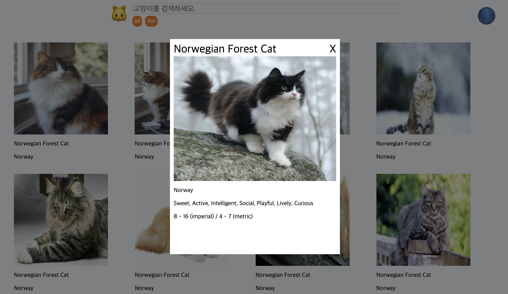

# ilovecat
>  프로그래머스 2020 Dev-Matching : 웹 프론트엔드 과제 복기

### 개발환경

- `babel`, `eslint`, [`Web Server for Chrome`](https://chrome.google.com/webstore/detail/web-server-for-chrome/ofhbbkphhbklhfoeikjpcbhemlocgigb)
  - FrontEnd 학습에 더 집중하기 위해 Server는 간편하게 Web Server for Chrome을 사용했다.
  - Webpack을 사용하지 않았다.
- **Vanila JavaScript만을 사용하여 구현**

### 학습 포인트

- [**요구사항에 따른 퍼블리싱 : 시맨틱 웹, 반응형 페이지**](https://velog.io/@hyeon930/요구사항에-따른-퍼블리싱-시맨틱-웹-반응형-페이지)
- [**유저의 입력에 반응하기 로딩 화면과 결과 없음 : Event loop, Class**](https://velog.io/@hyeon930/유저의-입력에-반응하기-로딩-화면과-결과-없음-Event-loop-Class)
- [**Modal 만들기 : Event propagation**](https://velog.io/@hyeon930/Modal-만들기-Event-propagation)
- [**이벤트 리스너 줄이기 : Event deligation**](https://velog.io/@hyeon930/이벤트-리스너-줄이기-Event-deligation)
- [**필요한 시점에 필요한 리소스 가져오기 : Lazy load**](https://velog.io/@hyeon930/필요한-시점에-필요한-리소스-가져오기-Lazy-loading)

- [**새로고침 후에도 결과 화면 유지하기 : Web storage API**](https://velog.io/@hyeon930/새로고침-후에도-결과-화면-유지하기-Web-Storage-API)
- [**무한 스크롤 만들기 : Throttling**](https://velog.io/@hyeon930/무한-스크롤-만들기-Throttling)
- [**비동기 요청 에러 핸들링하기**]()
- [**prefers-color-scheme을 이용한 다크 모드 구현**]()

